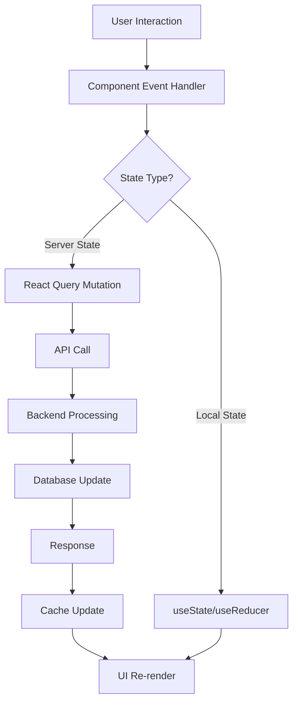

# Design Document: Interactive Drag-and-Drop Meal Planning Calendar

## Overview

The Interactive Drag-and-Drop Meal Planning Calendar is a React-based frontend component that provides users with an intuitive visual interface for planning their weekly meals. The design leverages modern web technologies to create a smooth, responsive experience that integrates seamlessly with the existing meal planning backend infrastructure.

The core design philosophy centers around reducing friction in meal planning through visual interaction patterns that users already understand from other applications. By implementing drag-and-drop functionality, we eliminate the need for complex forms and multi-step processes, allowing users to plan their entire week in minutes rather than hours.

## Architecture

### Component Architecture

The calendar system follows a hierarchical component structure that promotes reusability and maintainability:

```
MealPlannerCalendar (Container)
├── CalendarHeader (Week Navigation + Actions)
├── RecipeSidebar (Recipe Browser)
│   ├── RecipeSearch
│   ├── RecipeFilters
│   └── RecipeList
│       └── RecipeCard (Draggable)
└── CalendarGrid (Drop Zone)
    └── DayColumn (7 instances)
        └── MealSlot (3 per day - B/L/D)
            └── MealCard (When populated)
```

### State Management Architecture

The application uses a layered state management approach:

1. **Server State**: React Query manages all API interactions, caching, and synchronization
2. **Local UI State**: React hooks handle component-specific state (drag operations, UI toggles)
3. **Shared State**: Context API manages cross-component state (current week, selected recipes)

### Data Flow Architecture



## Components and Interfaces

### Core Components

#### MealPlannerCalendar
**Purpose**: Main container component that orchestrates the entire calendar experience
**Props**:
```typescript
interface MealPlannerCalendarProps {
  initialWeek?: Date;
  userId: string;
  onMealPlanChange?: (mealPlan: MealPlan) => void;
}
```

#### CalendarGrid
**Purpose**: Renders the 7-day × 3-meal grid layout with drop zone functionality
**Props**:
```typescript
interface CalendarGridProps {
  weekStartDate: Date;
  mealPlan: MealPlan;
  onMealAssign: (dayIndex: number, mealType: MealType, recipe: Recipe) => void;
  onMealRemove: (dayIndex: number, mealType: MealType) => void;
}
```

#### MealSlot
**Purpose**: Individual meal slot that can receive dropped recipes
**Props**:
```typescript
interface MealSlotProps {
  dayIndex: number;
  mealType: MealType;
  meal?: MealSlot;
  onMealAssign: (recipe: Recipe) => void;
  onMealRemove: () => void;
  isDropTarget: boolean;
}
```

#### RecipeSidebar
**Purpose**: Browsable recipe collection with search and filter capabilities
**Props**:
```typescript
interface RecipeSidebarProps {
  onRecipeSelect: (recipe: Recipe) => void;
  searchQuery: string;
  onSearchChange: (query: string) => void;
  filters: RecipeFilters;
  onFiltersChange: (filters: RecipeFilters) => void;
}
```

### Drag-and-Drop Interfaces

#### Drag Source (Recipe Cards)
```typescript
interface DragItem {
  type: 'RECIPE';
  recipe: Recipe;
  sourceType: 'SIDEBAR' | 'MEAL_SLOT';
  sourceLocation?: { dayIndex: number; mealType: MealType };
}
```

#### Drop Target (Meal Slots)
```typescript
interface DropResult {
  dayIndex: number;
  mealType: MealType;
  dropEffect: 'move' | 'copy';
}
```

### API Integration Interfaces

#### Meal Plan Service
```typescript
interface MealPlanService {
  getMealPlan(userId: string, weekStart: Date): Promise<MealPlan>;
  updateMealPlan(mealPlan: MealPlan): Promise<MealPlan>;
  createMealPlan(userId: string, weekStart: Date): Promise<MealPlan>;
}
```

#### Recipe Service
```typescript
interface RecipeService {
  searchRecipes(query: string, filters: RecipeFilters): Promise<Recipe[]>;
  getRecipe(recipeId: string): Promise<Recipe>;
  getFavoriteRecipes(userId: string): Promise<Recipe[]>;
}
```

## Data Models

### Core Data Structures

#### MealPlan
```typescript
interface MealPlan {
  id: string;
  userId: string;
  weekStartDate: Date;
  meals: {
    [dayOfWeek: string]: {
      breakfast?: MealSlot;
      lunch?: MealSlot;
      dinner?: MealSlot;
    };
  };
  createdAt: Date;
  updatedAt: Date;
}
```

#### MealSlot
```typescript
interface MealSlot {
  id: string;
  recipeId: string;
  recipe: Recipe;
  servings: number;
  notes?: string;
  scheduledFor: Date;
  mealType: MealType;
}
```

#### Recipe
```typescript
interface Recipe {
  id: string;
  name: string;
  description: string;
  imageUrl?: string;
  prepTime: number;
  cookTime: number;
  servings: number;
  difficulty: 'Easy' | 'Medium' | 'Hard';
  dietaryTags: string[];
  ingredients: Ingredient[];
  instructions: string[];
  nutritionInfo?: NutritionInfo;
  rating?: number;
  createdBy: string;
}
```

#### Drag State Management
```typescript
interface DragState {
  isDragging: boolean;
  draggedItem?: DragItem;
  dropTarget?: DropTarget;
  dragPreview?: {
    x: number;
    y: number;
    recipe: Recipe;
  };
}
```

### State Shape

#### Calendar State
```typescript
interface CalendarState {
  currentWeek: Date;
  mealPlan: MealPlan | null;
  isLoading: boolean;
  isDirty: boolean;
  lastSaved: Date | null;
  error: string | null;
}
```

#### UI State
```typescript
interface UIState {
  sidebarCollapsed: boolean;
  selectedMealSlot?: { dayIndex: number; mealType: MealType };
  showRecipeModal: boolean;
  selectedRecipe?: Recipe;
  dragState: DragState;
}
```

## Correctness Properties

*A property is a characteristic or behavior that should hold true across all valid executions of a system—essentially, a formal statement about what the system should do. Properties serve as the bridge between human-readable specifications and machine-verifiable correctness guarantees.*

### Calendar Structure Properties

**Property 1: Calendar Grid Structure**
*For any* week displayed in the calendar, the grid should contain exactly 7 day columns (Monday through Sunday) and each day should have exactly 3 meal slots (breakfast, lunch, dinner)
**Validates: Requirements US-1.1**

**Property 2: Week Navigation Consistency**
*For any* week navigation operation (previous/next), the displayed week should change by exactly 7 days and maintain the same day-of-week structure
**Validates: Requirements US-1.2**

**Property 3: Meal Card Information Completeness**
*For any* populated meal slot, the displayed meal card should contain the recipe name, image (when available), and key details (prep time, servings)
**Validates: Requirements US-1.3**

### Drag-and-Drop Properties

**Property 4: Recipe Sidebar Functionality**
*For any* recipe search or filter operation, the sidebar should return only recipes that match the specified criteria and display them in a draggable format
**Validates: Requirements US-2.1**

**Property 5: Drag-and-Drop State Consistency**
*For any* successful drag-and-drop operation from sidebar to meal slot or between meal slots, the meal plan state should be updated to reflect the new meal assignment and the UI should reflect this change
**Validates: Requirements US-2.2, US-2.4**

**Property 6: Drag Visual Feedback**
*For any* active drag operation, the UI should display appropriate visual feedback including drag preview, drop zone highlighting, and hover states
**Validates: Requirements US-2.3**

**Property 7: Undo/Redo State Management**
*For any* meal assignment operation, performing undo should restore the previous meal plan state, and performing redo should restore the undone operation
**Validates: Requirements US-2.5**

### Meal Management Properties

**Property 8: Meal Removal Operations**
*For any* meal removal operation (delete, clear day), the targeted meal slots should be emptied and the meal plan state should be updated accordingly
**Validates: Requirements US-3.1, US-3.5**

**Property 9: Meal Duplication Operations**
*For any* meal copy or duplication operation (copy meal, duplicate day/week), the target location should receive an identical meal assignment without affecting the source location
**Validates: Requirements US-3.2, US-3.4**

**Property 10: Meal Swap Operations**
*For any* meal swap operation between two slots, the meals should exchange positions such that slot A contains the meal originally in slot B and vice versa
**Validates: Requirements US-3.3**

### Recipe Integration Properties

**Property 11: Recipe Detail Modal Activation**
*For any* meal card click event, the recipe detail modal should open and display the complete recipe information for that meal
**Validates: Requirements US-4.1**

**Property 12: Recipe Information Display**
*For any* recipe displayed in the detail modal, all available recipe information should be shown including ingredients, instructions, prep time, servings, ratings, and dietary information
**Validates: Requirements US-4.2, US-4.3**

**Property 13: Serving Adjustment Consistency**
*For any* serving size adjustment made from the calendar view, the meal slot should update to reflect the new serving count and any dependent calculations should be recalculated
**Validates: Requirements US-4.4**

### Data Persistence Properties

**Property 14: Auto-save and Load Consistency**
*For any* meal plan modification, the changes should be automatically saved to the backend, and when the calendar is reloaded, it should display the most recent saved state
**Validates: Requirements US-5.1, US-5.2**

**Property 15: Offline Graceful Degradation**
*For any* network failure scenario, the application should continue to function with local state and provide appropriate user feedback about connectivity status
**Validates: Requirements US-5.3**

### Shopping List Integration Properties

**Property 16: Shopping List Generation**
*For any* meal plan with assigned recipes, generating a shopping list should create a list containing all ingredients from the assigned recipes, properly consolidated and organized
**Validates: Requirements US-6.1**

**Property 17: Shopping List Preview Accuracy**
*For any* shopping list generation operation, the preview should accurately reflect the ingredients and quantities that will be included in the final shopping list
**Validates: Requirements US-6.2**

**Property 18: Shopping List Service Integration**
*For any* shopping list finalization, the system should successfully integrate with the existing shopping list service and provide confirmation of the operation
**Validates: Requirements US-6.3**

**Property 19: Meal Contribution Visual Indicators**
*For any* shopping list generation process, meals that contribute ingredients to the shopping list should display appropriate visual indicators in the calendar view
**Validates: Requirements US-6.4**

## Error Handling

### Client-Side Error Handling

**Network Errors**: The application implements comprehensive error boundaries and retry mechanisms for all API interactions. When network requests fail, the system provides clear user feedback and maintains local state integrity.

**Drag-and-Drop Errors**: Invalid drop operations (such as dropping on occupied slots when not intended) are prevented through validation logic. The system provides visual feedback for invalid drop targets and maintains consistent state.

**State Synchronization Errors**: When auto-save operations fail, the application maintains a dirty state indicator and provides manual save options. Optimistic updates are rolled back if server confirmation fails.

### Server Integration Error Handling

**API Response Validation**: All API responses are validated against expected schemas. Invalid responses trigger error states with appropriate user messaging and fallback behaviors.

**Authentication Errors**: Expired or invalid authentication tokens trigger re-authentication flows without losing user work. The system maintains draft state during authentication processes.

**Conflict Resolution**: When meal plan conflicts occur (multiple devices editing simultaneously), the system provides conflict resolution UI allowing users to choose between versions or merge changes.

## Testing Strategy

### Dual Testing Approach

The testing strategy employs both unit testing and property-based testing to ensure comprehensive coverage:

**Unit Tests**: Focus on specific examples, edge cases, and error conditions including:
- Component rendering with various props combinations
- User interaction handlers (clicks, drags, form submissions)
- API integration points and error scenarios
- State management edge cases

**Property Tests**: Verify universal properties across all inputs including:
- Calendar structure consistency across different weeks and years
- Drag-and-drop operations maintaining state integrity
- Meal plan persistence and loading operations
- Shopping list generation accuracy across various meal combinations

### Property-Based Testing Configuration

**Testing Library**: Jest with fast-check for property-based testing
**Test Configuration**: Minimum 100 iterations per property test to ensure comprehensive input coverage
**Test Tagging**: Each property test includes a comment referencing its design document property:
```javascript
// Feature: drag-and-drop-meal-planning, Property 1: Calendar Grid Structure
```

### Testing Framework Integration

**Frontend Testing Stack**:
- **Jest**: Primary testing framework for both unit and property tests
- **React Testing Library**: Component testing with user-centric queries
- **fast-check**: Property-based testing library for generating test inputs
- **MSW (Mock Service Worker)**: API mocking for integration tests

**Test Organization**:
- Component tests co-located with source files using `.test.tsx` suffix
- Property tests organized by feature area in dedicated test directories
- Integration tests covering complete user workflows
- Performance tests for drag-and-drop operations and large dataset handling

### Coverage Requirements

**Unit Test Coverage**: Focus on critical business logic, user interactions, and error handling paths
**Property Test Coverage**: All correctness properties must have corresponding property-based tests
**Integration Coverage**: Complete user workflows from recipe selection through shopping list generation
**Performance Coverage**: Drag-and-drop operations must maintain 60fps performance under test conditions