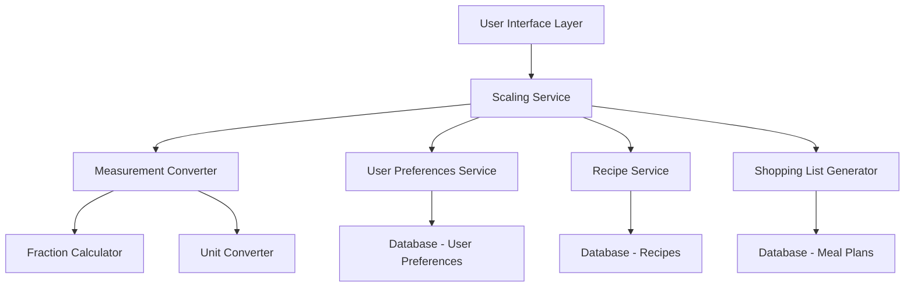

# Design Document: Household Size and Recipe Scaling

## Overview

The household size and recipe scaling feature provides intelligent ingredient quantity adjustment based on user preferences and manual overrides. The system maintains recipe integrity through precise mathematical scaling while offering practical measurement conversions and clear visual feedback to users.

The design implements a Recipe Conversion Factor (RCF) approach where scaling factor = target servings ÷ original servings, applied uniformly to all ingredients while handling edge cases and measurement practicalities. The system supports both automatic household-based scaling and manual per-recipe overrides, with all changes reflected in shopping list generation.

## Architecture

### Component Overview



### Data Flow

1. **Household Size Setting**: User → UI → User Preferences Service → Database
2. **Recipe Scaling**: Recipe + Household Size → Scaling Service → Measurement Converter → Scaled Recipe
3. **Manual Override**: User → UI → Meal Plan Service → Database (per-recipe override)
4. **Shopping List Generation**: Meal Plans → Shopping List Generator → Scaled Quantities

## Components and Interfaces

### ScalingService

**Purpose**: Core business logic for recipe scaling calculations and coordination

**Key Methods**:
```typescript
interface ScalingService {
  calculateScalingFactor(originalServings: number, targetServings: number): number;
  scaleRecipe(recipe: Recipe, scalingFactor: number): ScaledRecipe;
  getEffectiveServingSize(recipe: Recipe, householdSize: number, manualOverride?: number): number;
  scaleIngredientQuantity(ingredient: Ingredient, scalingFactor: number): ScaledIngredient;
}
```

**Scaling Factor Calculation**:
- Formula: `scalingFactor = targetServings / originalServings`
- Default original servings: 1 (if undefined or 0)
- Minimum scaling factor: 0.125 (1/8)
- Maximum scaling factor: 20

### MeasurementConverter

**Purpose**: Handles measurement unit conversions and practical rounding

**Key Methods**:
```typescript
interface MeasurementConverter {
  convertToCommonUnit(quantity: number, unit: string): StandardMeasurement;
  roundToPracticalMeasurement(quantity: number, unit: string): PracticalMeasurement;
  convertBetweenSystems(quantity: number, fromUnit: string, toUnit: string): number;
  formatForDisplay(measurement: PracticalMeasurement): string;
}
```

**Conversion Standards**:
- 1 cup = 16 tablespoons = 48 teaspoons = 236.59 mL
- 1 tablespoon = 3 teaspoons = 14.79 mL
- 1 fluid ounce = 2 tablespoons = 29.57 mL
- Practical fractions: 1/8, 1/6, 1/4, 1/3, 1/2, 2/3, 3/4

### FractionCalculator

**Purpose**: Handles fractional arithmetic and simplification for cooking measurements

**Key Methods**:
```typescript
interface FractionCalculator {
  multiply(fraction: Fraction, factor: number): Fraction;
  simplify(fraction: Fraction): Fraction;
  toMixedNumber(improperFraction: Fraction): MixedNumber;
  toPracticalFraction(decimal: number): Fraction;
  formatForCooking(fraction: Fraction): string;
}
```

**Rounding Rules**:
- Round to nearest 1/8 for quantities > 1 cup
- Round to nearest 1/16 for quantities 1/4 to 1 cup  
- Round to nearest 1/32 for quantities < 1/4 cup
- Minimum quantity: 1/32 teaspoon (pinch)

### UserPreferencesService

**Purpose**: Manages persistent user settings including household size

**Key Methods**:
```typescript
interface UserPreferencesService {
  getHouseholdSize(userId: string): Promise<number>;
  setHouseholdSize(userId: string, size: number): Promise<void>;
  validateHouseholdSize(size: number): ValidationResult;
}
```

**Validation Rules**:
- Household size: 1-20 people
- Default: 2 people
- Must be positive integer

### MealPlanService (Extended)

**Purpose**: Manages meal plans with scaling overrides

**New Methods**:
```typescript
interface MealPlanService {
  setManualServingOverride(mealPlanId: string, recipeId: string, servings: number): Promise<void>;
  removeManualServingOverride(mealPlanId: string, recipeId: string): Promise<void>;
  getEffectiveServings(mealPlanId: string, recipeId: string): Promise<number>;
}
```

## Data Models

### ScaledRecipe

```typescript
interface ScaledRecipe {
  id: string;
  originalRecipe: Recipe;
  scalingFactor: number;
  effectiveServings: number;
  scaledIngredients: ScaledIngredient[];
  scalingSource: 'household' | 'manual';
  manualServingOverride?: number;
}
```

### ScaledIngredient

```typescript
interface ScaledIngredient {
  id: string;
  name: string;
  originalQuantity: number;
  originalUnit: string;
  scaledQuantity: number;
  scaledUnit: string;
  displayQuantity: string; // Human-readable format (e.g., "1⅓ cups")
  conversionApplied: boolean;
}
```

### MealPlanEntry (Extended)

```typescript
interface MealPlanEntry {
  id: string;
  recipeId: string;
  date: string;
  mealType: string;
  manualServingOverride?: number; // New field
  createdAt: Date;
  updatedAt: Date;
}
```

### UserPreferences (Extended)

```typescript
interface UserPreferences {
  userId: string;
  householdSize: number; // New field
  measurementSystem: 'imperial' | 'metric';
  dietaryRestrictions: string[];
  // ... existing fields
}
```

Now I need to use the prework tool to analyze the acceptance criteria before writing the correctness properties section.

<function_calls>
<invoke name="prework">
<parameter name="featureName">household-size-recipe-scaling

## Correctness Properties

*A property is a characteristic or behavior that should hold true across all valid executions of a system—essentially, a formal statement about what the system should do. Properties serve as the bridge between human-readable specifications and machine-verifiable correctness guarantees.*

### Property 1: Household Size Validation and Persistence
*For any* user and any household size input, if the input is valid (1-20), then setting it should persist the value and make it retrievable on subsequent logins; if invalid, the system should reject it and maintain the previous value.
**Validates: Requirements 1.2, 1.3, 6.1**

### Property 2: Scaling Factor Calculation Consistency  
*For any* recipe with original serving size and any target serving size, the scaling factor should always equal target servings divided by original servings, with undefined or zero original servings treated as 1.
**Validates: Requirements 2.1, 2.4**

### Property 3: Ingredient Scaling Preservation
*For any* recipe and scaling factor, all ingredients should be multiplied by the same scaling factor, and the original recipe data should remain unchanged after scaling operations.
**Validates: Requirements 2.2, 2.5**

### Property 4: Manual Override Precedence
*For any* meal plan entry with a manual serving override, the effective serving size should equal the manual override value regardless of household size changes, until the override is explicitly removed.
**Validates: Requirements 3.2, 6.5**

### Property 5: Manual Override Round-trip Persistence
*For any* meal plan entry with manual serving overrides, saving and reloading the meal plan should restore all manual overrides exactly as they were set.
**Validates: Requirements 3.5, 6.2, 6.3**

### Property 6: Override Removal Reversion
*For any* meal plan entry with a manual override, removing the override should revert the effective serving size to household-based automatic scaling.
**Validates: Requirements 3.4**

### Property 7: Shopping List Scaling Integration
*For any* meal plan containing scaled recipes, the generated shopping list should use the scaled ingredient quantities, with duplicate ingredients consolidated using their scaled amounts.
**Validates: Requirements 4.1, 4.2, 4.4**

### Property 8: Unit Conversion Accuracy
*For any* ingredient quantities requiring unit conversion during consolidation, the conversion should maintain accuracy within 5% and convert to appropriate common units before summation.
**Validates: Requirements 4.3, 4.5**

### Property 9: Measurement Rounding Practicality
*For any* scaled ingredient quantity, the result should be rounded to practical cooking measurements (1/8, 1/6, 1/4, 1/3, 1/2, 2/3, 3/4) with appropriate precision for the ingredient type and quantity range.
**Validates: Requirements 2.3, 7.1, 7.2, 7.3, 7.5**

### Property 10: Cross-System Measurement Consistency
*For any* recipe using either imperial or metric measurements, scaling operations should maintain consistent behavior and accuracy regardless of the measurement system used.
**Validates: Requirements 7.4**

### Property 11: Real-time Scaling Updates
*For any* existing meal plans when household size changes, all recipe scaling should update immediately without requiring page refresh, while preserving any manual overrides.
**Validates: Requirements 1.4, 6.4**

### Property 12: UI Scaling Indicators
*For any* scaled recipe displayed in the interface, appropriate visual indicators should be present showing scaling status, scaling factor, and manual override status where applicable.
**Validates: Requirements 5.1, 5.2, 5.3, 5.5**

### Property 13: UI Toggle Functionality
*For any* recipe view with ingredient quantities, toggling between original and scaled amounts should correctly display the appropriate values for all ingredients.
**Validates: Requirements 5.4**

## Error Handling

### Input Validation
- **Household Size**: Reject values outside 1-20 range with clear error messages
- **Manual Serving Overrides**: Validate positive numbers, cap at reasonable limits (1-50)
- **Recipe Data**: Handle missing/invalid serving sizes by defaulting to 1 serving

### Calculation Safeguards
- **Division by Zero**: Treat zero or undefined original servings as 1
- **Extreme Scaling**: Cap scaling factors between 0.125 and 20 to prevent unrealistic results
- **Measurement Limits**: Prevent scaling below 1/32 teaspoon or above practical cooking quantities

### Data Integrity
- **Preference Corruption**: Reset to default household size (2) if data is corrupted
- **Manual Override Conflicts**: Resolve conflicts by prioritizing most recent user action
- **Network Failures**: Cache changes locally and sync when connectivity is restored

### User Experience
- **Unparseable Quantities**: Display original text with scaling note when quantities cannot be parsed
- **Impossible Measurements**: Show capped values with user notification when calculations exceed practical limits
- **Loading States**: Show appropriate loading indicators during scaling calculations

## Testing Strategy

### Dual Testing Approach

The testing strategy employs both unit tests and property-based tests as complementary approaches:

**Unit Tests** focus on:
- Specific examples and edge cases (default household size, boundary values)
- Integration points between scaling service and UI components  
- Error conditions and recovery scenarios
- Manual override workflows and UI interactions

**Property-Based Tests** focus on:
- Universal properties that hold across all valid inputs
- Comprehensive input coverage through randomization
- Mathematical correctness of scaling calculations
- Data persistence and round-trip operations

### Property-Based Testing Configuration

**Testing Library**: fast-check for TypeScript/JavaScript property-based testing
**Test Configuration**: Minimum 100 iterations per property test
**Test Tagging**: Each property test references its design document property

**Tag Format**: `Feature: household-size-recipe-scaling, Property {number}: {property_text}`

### Key Test Categories

**Scaling Mathematics**:
- Property tests for scaling factor calculations with random household sizes and recipe servings
- Property tests for ingredient quantity scaling with various measurement units
- Property tests for fractional rounding to practical cooking measurements

**Data Persistence**:
- Property tests for household size round-trip persistence
- Property tests for manual override persistence across sessions
- Property tests for preference loading and saving

**UI Integration**:
- Unit tests for scaling indicator display
- Unit tests for manual override interface functionality
- Property tests for real-time updates when household size changes

**Shopping List Generation**:
- Property tests for scaled quantity consolidation
- Property tests for unit conversion accuracy
- Unit tests for duplicate ingredient handling

**Error Handling**:
- Unit tests for invalid input rejection
- Unit tests for data corruption recovery
- Edge case tests for extreme scaling scenarios