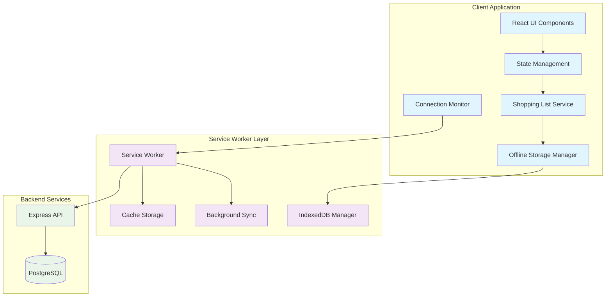
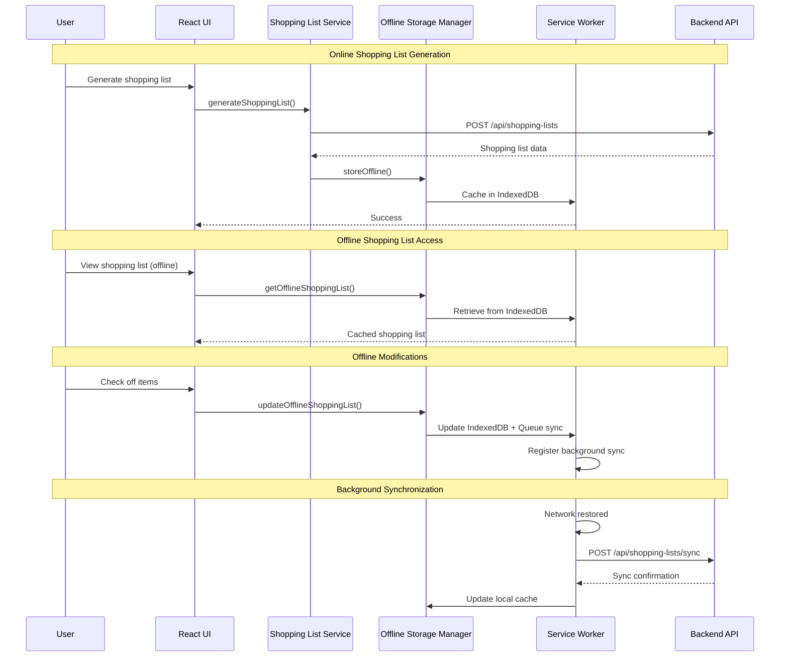

# Design Document: PWA Offline Shopping List

## Overview

This design implements Progressive Web App (PWA) functionality with offline shopping list access for the Shop&Chop meal planning application. The solution leverages service workers, IndexedDB, and the Background Sync API to provide seamless offline shopping experiences on mobile devices.

The design builds upon the existing shopping list generation functionality and extends it with offline capabilities, ensuring users can access and modify their shopping lists even in areas with poor cellular connectivity. The implementation follows modern PWA patterns with cache-first strategies for static assets and intelligent synchronization for dynamic data.

## Architecture

### High-Level Architecture



### Data Flow Architecture



## Components and Interfaces

### 1. Enhanced Shopping List Service

Extends the existing `ShoppingListService` with offline capabilities:

```typescript
interface OfflineShoppingListService {
  // Existing methods
  generateFromMealPlan(mealPlan: MealPlan, householdSize: number): ShoppingList;
  
  // New offline methods
  storeOfflineShoppingList(shoppingList: ShoppingList, metadata: ShoppingListMetadata): Promise<void>;
  getOfflineShoppingList(id: string): Promise<ShoppingList | null>;
  updateOfflineShoppingList(id: string, updates: Partial<ShoppingList>): Promise<void>;
  getAllOfflineShoppingLists(): Promise<OfflineShoppingListEntry[]>;
  deleteOfflineShoppingList(id: string): Promise<void>;
  queueForSync(operation: SyncOperation): Promise<void>;
}

interface ShoppingListMetadata {
  id: string;
  mealPlanId: string;
  weekStartDate: string;
  generatedAt: Date;
  lastModified: Date;
  syncStatus: 'synced' | 'pending' | 'conflict';
  deviceId: string;
}

interface OfflineShoppingListEntry {
  metadata: ShoppingListMetadata;
  shoppingList: ShoppingList;
}
```

### 2. Offline Storage Manager

Manages IndexedDB operations and data persistence:

```typescript
interface OfflineStorageManager {
  initialize(): Promise<void>;
  
  // Shopping list operations
  storeShoppingList(entry: OfflineShoppingListEntry): Promise<void>;
  getShoppingList(id: string): Promise<OfflineShoppingListEntry | null>;
  getAllShoppingLists(): Promise<OfflineShoppingListEntry[]>;
  updateShoppingList(id: string, updates: Partial<OfflineShoppingListEntry>): Promise<void>;
  deleteShoppingList(id: string): Promise<void>;
  
  // Sync queue operations
  addToSyncQueue(operation: SyncOperation): Promise<void>;
  getSyncQueue(): Promise<SyncOperation[]>;
  removeSyncOperation(id: string): Promise<void>;
  clearSyncQueue(): Promise<void>;
  
  // Storage management
  getStorageUsage(): Promise<StorageUsage>;
  cleanupOldData(retentionDays: number): Promise<void>;
}

interface SyncOperation {
  id: string;
  type: 'create' | 'update' | 'delete';
  shoppingListId: string;
  data: any;
  timestamp: Date;
  retryCount: number;
}

interface StorageUsage {
  used: number;
  available: number;
  percentage: number;
}
```

### 3. Connection Monitor

Tracks network connectivity and manages sync triggers:

```typescript
interface ConnectionMonitor {
  isOnline: boolean;
  connectionType: 'wifi' | 'cellular' | 'unknown';
  
  initialize(): void;
  onConnectionChange(callback: (isOnline: boolean) => void): void;
  triggerManualSync(): Promise<void>;
  getPendingSyncCount(): Promise<number>;
}
```

### 4. Background Sync Manager

Handles background synchronization operations:

```typescript
interface BackgroundSyncManager {
  registerSync(tag: string, data?: any): Promise<void>;
  handleSyncEvent(event: SyncEvent): Promise<void>;
  processSyncQueue(): Promise<void>;
  retryFailedOperations(): Promise<void>;
}
```

### 5. PWA Installation Manager

Manages PWA installation prompts and lifecycle:

```typescript
interface PWAInstallationManager {
  canInstall: boolean;
  isInstalled: boolean;
  
  initialize(): void;
  showInstallPrompt(): Promise<boolean>;
  onInstallStateChange(callback: (installed: boolean) => void): void;
  trackInstallationMetrics(): void;
}
```

## Data Models

### Enhanced Shopping List Types

```typescript
// Extends existing ShoppingListItem
interface OfflineShoppingListItem extends ShoppingListItem {
  id: string;
  lastModified: Date;
  syncStatus: 'synced' | 'pending' | 'conflict';
}

// Extends existing ShoppingList
interface OfflineShoppingList {
  [category: string]: OfflineShoppingListItem[];
}

// New offline-specific types
interface OfflineShoppingListState {
  id: string;
  metadata: ShoppingListMetadata;
  shoppingList: OfflineShoppingList;
  pendingChanges: ShoppingListChange[];
}

interface ShoppingListChange {
  id: string;
  type: 'item_check' | 'item_uncheck' | 'item_add' | 'item_remove';
  itemId: string;
  category: string;
  timestamp: Date;
  data: any;
}
```

### IndexedDB Schema

```typescript
interface ShoppingListDB {
  shoppingLists: {
    key: string; // shopping list ID
    value: OfflineShoppingListEntry;
    indexes: {
      mealPlanId: string;
      weekStartDate: string;
      lastModified: Date;
    };
  };
  
  syncQueue: {
    key: string; // operation ID
    value: SyncOperation;
    indexes: {
      timestamp: Date;
      type: string;
      shoppingListId: string;
    };
  };
  
  metadata: {
    key: string; // metadata key
    value: any;
  };
}
```

## Correctness Properties

*A property is a characteristic or behavior that should hold true across all valid executions of a system—essentially, a formal statement about what the system should do. Properties serve as the bridge between human-readable specifications and machine-verifiable correctness guarantees.*

Based on the prework analysis and property reflection, here are the consolidated correctness properties:

### Property 1: PWA Manifest Completeness
*For any* PWA manifest file, it should contain all required fields (name, short_name, icons, theme_color, background_color, display, start_url) with valid values for proper installation and native-like appearance.
**Validates: Requirements 1.1, 1.4**

### Property 2: Service Worker Registration and Activation
*For any* app load, the service worker should register and activate successfully without errors.
**Validates: Requirements 2.1**

### Property 3: Comprehensive Caching Strategy
*For any* resource request, the service worker should apply the correct caching strategy (cache-first for static assets, network-first for dynamic data) and serve cached resources when offline.
**Validates: Requirements 2.2, 2.3, 2.5**

### Property 4: Cache Update Consistency
*For any* app update, the service worker should update cached resources automatically and maintain cache consistency.
**Validates: Requirements 2.4**

### Property 5: Offline Shopping List Storage
*For any* generated shopping list, it should be stored in IndexedDB with complete metadata (generation date, meal plan reference) and be retrievable offline.
**Validates: Requirements 3.1, 3.2, 3.5**

### Property 6: Offline State Persistence
*For any* offline shopping list modification, the changes should be persisted locally and maintain data isolation between multiple shopping lists.
**Validates: Requirements 3.3, 3.4**

### Property 7: Shopping List UI State Management
*For any* shopping list item interaction, the UI should toggle checked state, provide visual feedback, and display items organized by category.
**Validates: Requirements 4.1, 4.2, 4.3**

### Property 8: Connection State Indication
*For any* network status change, the connection monitor should update the offline state indicator and display pending sync count when offline.
**Validates: Requirements 4.4, 7.1, 7.2, 7.3, 7.4**

### Property 9: Data Synchronization Completeness
*For any* connectivity restoration, the sync manager should detect the state change, synchronize modified shopping lists, and update local cache with server responses.
**Validates: Requirements 5.1, 5.2, 5.4**

### Property 10: Conflict Resolution Priority
*For any* sync conflict between local and server data, the sync manager should prioritize local changes for shopping list item states.
**Validates: Requirements 5.3**

### Property 11: Sync Retry Logic
*For any* failed synchronization, the sync manager should retry with exponential backoff strategy.
**Validates: Requirements 5.5**

### Property 12: Background Sync Processing
*For any* background sync trigger, the service worker should process queued offline changes and clear the sync queue upon successful completion.
**Validates: Requirements 6.1, 6.2, 6.3**

### Property 13: Background Sync Retry Scheduling
*For any* failed background sync, the service worker should schedule retry attempts.
**Validates: Requirements 6.4**

### Property 14: Data Persistence Across Sessions
*For any* app closure while offline, shopping list data should be preserved in persistent storage and restored when the app reopens.
**Validates: Requirements 8.1, 8.2**

### Property 15: Data Recovery and Retention
*For any* corrupted shopping list data, the system should attempt recovery from backup data and maintain shopping list history for the current week.
**Validates: Requirements 8.3, 8.4**

### Property 16: Storage Quota Management
*For any* storage quota exceeded scenario, the system should clean up old data while preserving current shopping lists.
**Validates: Requirements 8.5**

### Property 17: Cache Size Management
*For any* cache operation, the cache manager should limit cached data to essential resources and implement LRU eviction when storage thresholds are exceeded.
**Validates: Requirements 9.1, 9.2**

### Property 18: Data Compression Consistency
*For any* shopping list storage operation, the data should be compressed before storing in IndexedDB.
**Validates: Requirements 9.3**

### Property 19: Cross-Device Data Consistency
*For any* user login on a new device, recent shopping lists should be downloaded and cached, and modifications should propagate to other devices when online.
**Validates: Requirements 10.1, 10.2, 10.4**

### Property 20: Multi-Device Conflict Resolution
*For any* scenario where multiple devices modify the same shopping list offline, the conflict resolver should merge changes intelligently.
**Validates: Requirements 10.3**

### Property 21: Cache Expiration Policy
*For any* device that hasn't been used recently, the cache manager should expire its offline shopping list cache.
**Validates: Requirements 10.5**

<function_calls>
<invoke name="prework">
<parameter name="featureName">pwa-offline-shopping-list

## Error Handling

### Service Worker Error Handling

```typescript
interface ServiceWorkerErrorHandler {
  handleRegistrationError(error: Error): void;
  handleCacheError(error: Error, request: Request): Response;
  handleSyncError(error: Error, operation: SyncOperation): void;
  handleStorageQuotaExceeded(error: Error): void;
}
```

**Error Scenarios:**
- **Service Worker Registration Failure**: Fallback to network-only mode with user notification
- **Cache Storage Errors**: Serve from network with error logging
- **IndexedDB Errors**: Attempt recovery from backup data or reset storage
- **Sync Failures**: Implement exponential backoff with maximum retry limits
- **Storage Quota Exceeded**: Trigger aggressive cleanup and user notification

### Network Error Handling

```typescript
interface NetworkErrorHandler {
  handleOfflineMode(): void;
  handleSyncFailure(operation: SyncOperation): void;
  handleConflictResolution(conflict: DataConflict): void;
  handleTimeoutErrors(request: Request): void;
}
```

**Network Error Patterns:**
- **Connection Loss**: Queue operations for background sync
- **Server Errors**: Retry with exponential backoff
- **Timeout Errors**: Fallback to cached data
- **Conflict Resolution**: Prioritize local changes for shopping list states

### Data Integrity Error Handling

```typescript
interface DataIntegrityHandler {
  validateShoppingListData(data: any): boolean;
  handleCorruptedData(id: string): Promise<void>;
  performDataMigration(oldVersion: number, newVersion: number): Promise<void>;
  createBackupData(data: OfflineShoppingListEntry): Promise<void>;
}
```

**Data Protection Strategies:**
- **Validation**: Schema validation before storage operations
- **Backup**: Automatic backup creation before modifications
- **Recovery**: Multi-level recovery from backup data
- **Migration**: Safe data migration between schema versions

## Testing Strategy

### Dual Testing Approach

The testing strategy employs both unit tests and property-based tests to ensure comprehensive coverage:

**Unit Tests** focus on:
- Specific examples and edge cases
- Integration points between components
- Error conditions and recovery scenarios
- UI component behavior and state management

**Property-Based Tests** focus on:
- Universal properties that hold for all inputs
- Comprehensive input coverage through randomization
- Data consistency across different scenarios
- Correctness properties validation

### Property-Based Testing Configuration

- **Testing Library**: Fast-check for JavaScript/TypeScript property-based testing
- **Minimum Iterations**: 100 iterations per property test
- **Test Tagging**: Each property test references its design document property
- **Tag Format**: `Feature: pwa-offline-shopping-list, Property {number}: {property_text}`

### Testing Categories

#### 1. PWA Infrastructure Tests

**Unit Tests:**
- Service worker registration and lifecycle
- Manifest file validation
- Installation prompt handling
- Cache storage operations

**Property Tests:**
- Service worker caching strategies across different resource types
- Manifest completeness validation
- Cache update consistency

#### 2. Offline Storage Tests

**Unit Tests:**
- IndexedDB schema creation and migration
- Data serialization and deserialization
- Storage quota management
- Error recovery scenarios

**Property Tests:**
- Shopping list storage and retrieval consistency
- Data compression and decompression round-trips
- Storage cleanup and retention policies

#### 3. Synchronization Tests

**Unit Tests:**
- Network state detection
- Sync queue management
- Conflict resolution scenarios
- Background sync event handling

**Property Tests:**
- Data synchronization completeness
- Conflict resolution algorithms
- Cross-device consistency maintenance

#### 4. UI Integration Tests

**Unit Tests:**
- Offline indicator display
- Shopping list item interactions
- Connection state visualization
- Manual sync triggers

**Property Tests:**
- UI state management consistency
- Shopping list item state persistence
- Connection state indication accuracy

### Test Environment Setup

```typescript
// Test configuration for PWA features
const testConfig = {
  serviceWorker: {
    mockRegistration: true,
    simulateOffline: true,
    cacheStorage: 'memory'
  },
  indexedDB: {
    inMemory: true,
    resetBetweenTests: true
  },
  network: {
    mockFetch: true,
    simulateLatency: true,
    simulateFailures: true
  }
};
```

### Performance Testing

- **Load Time**: Initial app load under 3 seconds on 3G networks
- **Cache Performance**: Cache hit rates above 90% for static assets
- **Storage Efficiency**: Compressed data storage with 50%+ size reduction
- **Sync Performance**: Background sync completion within 30 seconds
- **Memory Usage**: Maximum 50MB memory footprint for offline data

### Integration Testing

- **End-to-End Offline Scenarios**: Complete shopping workflows without network
- **Cross-Device Synchronization**: Multi-device data consistency validation
- **Progressive Enhancement**: Graceful degradation when PWA features unavailable
- **Browser Compatibility**: Testing across major mobile browsers
- **Installation Testing**: PWA installation and home screen launch validation