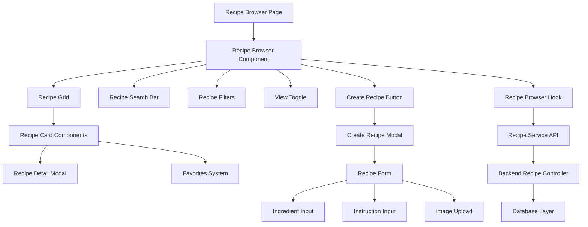

# Design Document: Recipe Browser with Advanced Search and User Recipe Creation

## Overview

The Recipe Browser feature provides a comprehensive recipe discovery and management system that transforms the placeholder "Recipes" page into a fully functional interface. Users can browse curated recipes, create their own custom recipes, and seamlessly integrate recipe discovery with meal planning. The design emphasizes performance, accessibility, and user experience while maintaining consistency with the existing Shop&Chop application.

## Architecture

### High-Level Architecture

The Recipe Browser follows the established client-server architecture pattern used throughout Shop&Chop:



### Component Hierarchy

```
RecipeBrowser (Container)
├── RecipeSearchBar (Search Input)
├── RecipeFilters (Filter Controls)
├── ViewToggle (Grid/List Toggle)
├── CreateRecipeButton (Action Button)
├── RecipeGrid (Layout Container)
│   └── RecipeCard[] (Recipe Items)
│       ├── FavoriteButton (Action)
│       ├── AddToMealPlanButton (Action)
│       └── RecipeDetailModal (Overlay)
├── CreateRecipeModal (Overlay)
│   └── RecipeForm (Form Container)
│       ├── ImageUpload (File Input)
│       ├── IngredientInput[] (Dynamic List)
│       └── InstructionInput[] (Dynamic List)
└── EditRecipeModal (Overlay)
    └── RecipeForm (Shared Component)
```

## Components and Interfaces

### Core Components

#### RecipeBrowser
**Purpose**: Main container component orchestrating recipe browsing functionality
**Props**:
```typescript
interface RecipeBrowserProps {
  // No props - self-contained page component
}
```

**State Management**:
- Search query and filters
- View mode (grid/list)
- Modal states (create/edit)
- Loading and error states

#### RecipeGrid
**Purpose**: Responsive layout for displaying recipe cards
**Props**:
```typescript
interface RecipeGridProps {
  recipes: Recipe[];
  viewMode: 'grid' | 'list';
  isLoading: boolean;
  onRecipeSelect: (recipe: Recipe) => void;
  onFavoriteToggle: (recipeId: string) => void;
  onAddToMealPlan: (recipe: Recipe) => void;
}
```

#### RecipeSearchBar
**Purpose**: Debounced search input with clear functionality
**Props**:
```typescript
interface RecipeSearchBarProps {
  value: string;
  onChange: (value: string) => void;
  placeholder?: string;
  isLoading?: boolean;
}
```

#### RecipeFilters
**Purpose**: Advanced filtering controls for recipe discovery
**Props**:
```typescript
interface RecipeFiltersProps {
  filters: RecipeFilters;
  onChange: (filters: Partial<RecipeFilters>) => void;
  onClear: () => void;
  isCollapsed?: boolean;
}
```

#### RecipeForm
**Purpose**: Shared form component for recipe creation and editing
**Props**:
```typescript
interface RecipeFormProps {
  initialData?: Partial<Recipe>;
  onSubmit: (data: RecipeFormData) => void;
  onCancel: () => void;
  isLoading?: boolean;
  mode: 'create' | 'edit';
}
```

### Data Models

#### Recipe Interface
```typescript
interface Recipe {
  id: string;
  title: string;
  description?: string;
  cuisine: string;
  cookTime: number; // minutes
  prepTime: number; // minutes
  servings: number;
  difficulty: 'Easy' | 'Medium' | 'Hard';
  dietaryTags: string[];
  ingredients: Ingredient[];
  instructions: string[];
  imageUrl?: string;
  userId?: string; // null for curated recipes
  createdAt: Date;
  updatedAt: Date;
  isFavorited?: boolean; // computed field
  favoriteCount?: number; // computed field
}
```

#### RecipeFilters Interface
```typescript
interface RecipeFilters {
  cuisine?: string;
  difficulty?: string;
  dietaryTags?: string[];
  maxCookTime?: number;
  showFavoritesOnly?: boolean;
  showUserRecipesOnly?: boolean;
}
```

#### RecipeFormData Interface
```typescript
interface RecipeFormData {
  title: string;
  description?: string;
  cuisine: string;
  cookTime: number;
  prepTime: number;
  servings: number;
  difficulty: 'Easy' | 'Medium' | 'Hard';
  dietaryTags: string[];
  ingredients: IngredientInput[];
  instructions: string[];
  image?: File;
}
```

## API Design

### Recipe CRUD Endpoints

#### GET /api/recipes
**Purpose**: Retrieve recipes with search and filtering
**Query Parameters**:
```typescript
interface RecipeQueryParams {
  search?: string;
  cuisine?: string;
  difficulty?: string;
  dietaryTags?: string[];
  maxCookTime?: number;
  showFavoritesOnly?: boolean;
  userId?: string; // for user's own recipes
  page?: number;
  limit?: number;
}
```

**Response**:
```typescript
interface RecipeListResponse {
  recipes: Recipe[];
  pagination: {
    page: number;
    limit: number;
    total: number;
    pages: number;
  };
}
```

#### POST /api/recipes
**Purpose**: Create new user recipe
**Request Body**:
```typescript
interface CreateRecipeRequest {
  title: string;
  description?: string;
  cuisine: string;
  cookTime: number;
  prepTime: number;
  servings: number;
  difficulty: string;
  dietaryTags: string[];
  ingredients: IngredientInput[];
  instructions: string[];
}
```

**File Upload**: Multipart form data for recipe image

#### PUT /api/recipes/:id
**Purpose**: Update existing user recipe
**Authorization**: Recipe owner only
**Request Body**: Same as CreateRecipeRequest (partial updates supported)

#### DELETE /api/recipes/:id
**Purpose**: Delete user recipe
**Authorization**: Recipe owner only

#### POST /api/recipes/:id/favorite
**Purpose**: Toggle recipe favorite status
**Authorization**: Authenticated user required

### Image Upload Handling

**Endpoint**: POST /api/recipes (multipart form data)
**File Validation**:
- Supported formats: JPG, PNG, WebP
- Maximum size: 5MB
- Image processing: Resize to standard dimensions (800x600)
- Storage: Local filesystem (development) / Cloud storage (production)

## State Management

### Recipe Browser State

```typescript
interface RecipeBrowserState {
  // Data
  recipes: Recipe[];
  totalCount: number;
  
  // UI State
  searchQuery: string;
  filters: RecipeFilters;
  viewMode: 'grid' | 'list';
  currentPage: number;
  
  // Loading States
  isLoading: boolean;
  isSearching: boolean;
  isCreating: boolean;
  
  // Modal States
  showCreateModal: boolean;
  showEditModal: boolean;
  editingRecipe: Recipe | null;
  
  // Error States
  error: string | null;
  validationErrors: Record<string, string>;
}
```

### Custom Hooks

#### useRecipeBrowser
**Purpose**: Main state management hook for recipe browser
```typescript
interface UseRecipeBrowserReturn {
  // Data
  recipes: Recipe[];
  totalCount: number;
  
  // State
  searchQuery: string;
  filters: RecipeFilters;
  viewMode: 'grid' | 'list';
  isLoading: boolean;
  error: string | null;
  
  // Actions
  setSearchQuery: (query: string) => void;
  setFilters: (filters: Partial<RecipeFilters>) => void;
  setViewMode: (mode: 'grid' | 'list') => void;
  clearFilters: () => void;
  refetch: () => void;
}
```

#### useFavorites
**Purpose**: Manage recipe favorites with optimistic updates
```typescript
interface UseFavoritesReturn {
  toggleFavorite: (recipeId: string) => Promise<void>;
  isFavorited: (recipeId: string) => boolean;
  isLoading: (recipeId: string) => boolean;
}
```

#### useCreateRecipe
**Purpose**: Handle recipe creation with image upload
```typescript
interface UseCreateRecipeReturn {
  createRecipe: (data: RecipeFormData) => Promise<Recipe>;
  isLoading: boolean;
  error: string | null;
  validationErrors: Record<string, string>;
}
```

## User Interface Design

### Layout Structure

#### Desktop Layout (≥1024px)
```
┌─────────────────────────────────────────────────────────────┐
│ Header: "Recipes" + Create Recipe Button                    │
├─────────────────────────────────────────────────────────────┤
│ Search Bar                                                  │
├─────────────────────────────────────────────────────────────┤
│ Filters Panel (Collapsible) + View Toggle                  │
├─────────────────────────────────────────────────────────────┤
│ Recipe Grid (4 columns)                                    │
│ ┌─────┐ ┌─────┐ ┌─────┐ ┌─────┐                           │
│ │Card │ │Card │ │Card │ │Card │                           │
│ └─────┘ └─────┘ └─────┘ └─────┘                           │
│ ┌─────┐ ┌─────┐ ┌─────┐ ┌─────┐                           │
│ │Card │ │Card │ │Card │ │Card │                           │
│ └─────┘ └─────┘ └─────┘ └─────┘                           │
└─────────────────────────────────────────────────────────────┘
```

#### Mobile Layout (≤768px)
```
┌─────────────────────────┐
│ Header + Menu Button    │
├─────────────────────────┤
│ Search Bar              │
├─────────────────────────┤
│ Filter Toggle           │
├─────────────────────────┤
│ Recipe Grid (1 column)  │
│ ┌─────────────────────┐ │
│ │     Recipe Card     │ │
│ └─────────────────────┘ │
│ ┌─────────────────────┐ │
│ │     Recipe Card     │ │
│ └─────────────────────┘ │
└─────────────────────────┘
```

### Recipe Card Design

#### Grid View Card
```
┌─────────────────────────┐
│      Recipe Image       │
│    (200x150px)         │
├─────────────────────────┤
│ Recipe Title            │
│ ⭐ 4.5 • 🕒 30min      │
│ 👥 4 servings          │
│ [vegetarian] [easy]     │
│                         │
│ [♡] [+] [👁]           │
└─────────────────────────┘
```

#### List View Card
```
┌─────────────────────────────────────────────────────────────┐
│ [Image] Recipe Title                              [♡] [+] [👁] │
│ 100x75  Description text...                                 │
│         ⭐ 4.5 • 🕒 30min • 👥 4 servings                  │
│         [vegetarian] [gluten-free] [easy]                   │
└─────────────────────────────────────────────────────────────┘
```

### Modal Designs

#### Create Recipe Modal
```
┌─────────────────────────────────────────────────────────────┐
│ Create Recipe                                           [×] │
├─────────────────────────────────────────────────────────────┤
│ ┌─────────────┐  Recipe Title: [________________]           │
│ │   Upload    │  Cuisine: [Dropdown ▼]                    │
│ │   Image     │  Difficulty: [Easy ▼]                     │
│ │   Area      │  Cook Time: [30] min  Servings: [4]       │
│ └─────────────┘                                            │
│                                                            │
│ Description: [________________________________]            │
│                                                            │
│ Dietary Tags: [vegetarian] [gluten-free] [+Add]           │
│                                                            │
│ Ingredients:                                               │
│ [2 cups] [flour] [×]                                      │
│ [1 tsp] [salt] [×]                                        │
│ [+ Add Ingredient]                                         │
│                                                            │
│ Instructions:                                              │
│ 1. [Mix flour and salt...] [×]                            │
│ 2. [Add water gradually...] [×]                           │
│ [+ Add Step]                                               │
│                                                            │
│                                    [Cancel] [Create Recipe] │
└─────────────────────────────────────────────────────────────┘
```

## Performance Considerations

### Frontend Optimizations

1. **Virtual Scrolling**: Implement for large recipe collections (>100 items)
2. **Image Lazy Loading**: Load recipe images as they enter viewport
3. **Debounced Search**: 300ms delay to reduce API calls
4. **React Query Caching**: Cache search results and filter combinations
5. **Optimistic Updates**: Immediate UI feedback for favorites and creation

### Backend Optimizations

1. **Database Indexing**: Index on searchable fields (title, cuisine, tags)
2. **Pagination**: Limit results to 20-50 items per page
3. **Image Optimization**: Resize and compress uploaded images
4. **Query Optimization**: Use efficient database queries with proper joins
5. **Caching**: Cache frequently accessed recipe data

### Loading States

1. **Initial Load**: Skeleton cards while fetching recipes
2. **Search**: Loading spinner in search bar
3. **Filter Changes**: Subtle loading overlay on grid
4. **Image Upload**: Progress indicator during upload
5. **Form Submission**: Disabled buttons with loading state

## Error Handling

### Client-Side Error Handling

1. **Network Errors**: Retry mechanism with exponential backoff
2. **Validation Errors**: Real-time form validation with clear messages
3. **Image Upload Errors**: File size/type validation with user feedback
4. **Search Errors**: Graceful degradation with cached results
5. **Favorites Errors**: Revert optimistic updates on failure

### Server-Side Error Handling

1. **Authentication Errors**: Clear 401/403 responses with redirect to login
2. **Validation Errors**: Detailed field-level error messages
3. **File Upload Errors**: Specific error codes for different failure types
4. **Database Errors**: Generic error messages to avoid exposing internals
5. **Rate Limiting**: Clear messaging about request limits

## Security Considerations

### Authentication and Authorization

1. **Recipe Ownership**: Users can only edit/delete their own recipes
2. **JWT Validation**: All recipe CRUD operations require valid tokens
3. **Input Sanitization**: Prevent XSS in recipe titles and descriptions
4. **File Upload Security**: Validate file types and scan for malicious content
5. **Rate Limiting**: Prevent abuse of recipe creation endpoints

### Data Validation

1. **Frontend Validation**: Real-time validation for user experience
2. **Backend Validation**: Server-side validation for security
3. **Image Validation**: File type, size, and content validation
4. **SQL Injection Prevention**: Use parameterized queries
5. **CSRF Protection**: Implement CSRF tokens for state-changing operations

## Testing Strategy

### Unit Tests

1. **Component Tests**: Test each component in isolation
2. **Hook Tests**: Test custom hooks with mock data
3. **Service Tests**: Test API service functions
4. **Utility Tests**: Test helper functions and validators
5. **Form Tests**: Test form validation and submission

### Integration Tests

1. **Recipe Browser Workflow**: Complete browsing and filtering flow
2. **Recipe Creation Workflow**: End-to-end recipe creation process
3. **Favorites System**: Test favorite toggle and persistence
4. **Search and Filter**: Test combined search and filter operations
5. **Mobile Responsiveness**: Test responsive behavior across devices

### Property-Based Tests

Property-based testing will validate universal correctness properties across all inputs to ensure robust behavior under various conditions.

## Accessibility

### Keyboard Navigation

1. **Tab Order**: Logical tab sequence through all interactive elements
2. **Focus Management**: Clear focus indicators and proper focus trapping in modals
3. **Keyboard Shortcuts**: Support for common operations (Escape to close modals)
4. **Skip Links**: Allow users to skip repetitive navigation elements

### Screen Reader Support

1. **ARIA Labels**: Comprehensive labeling for all interactive elements
2. **Live Regions**: Announce dynamic content changes (search results, errors)
3. **Semantic HTML**: Use proper heading hierarchy and landmark elements
4. **Alt Text**: Descriptive alt text for all recipe images

### Visual Accessibility

1. **Color Contrast**: WCAG 2.1 AA compliance for all text and interactive elements
2. **Focus Indicators**: High-contrast focus rings for keyboard navigation
3. **Text Scaling**: Support for 200% text scaling without horizontal scrolling
4. **Motion Preferences**: Respect user's reduced motion preferences

## Future Enhancements

### Phase 2 Features

1. **Recipe Collections**: User-created recipe collections and tags
2. **Recipe Sharing**: Share recipes with other users or publicly
3. **Recipe Import**: Import recipes from URLs or other formats
4. **Advanced Search**: Full-text search with relevance scoring
5. **Recipe Recommendations**: AI-powered recipe suggestions

### Phase 3 Features

1. **Nutritional Information**: Automatic nutrition calculation
2. **Recipe Scaling**: Dynamic ingredient scaling for different serving sizes
3. **Meal Prep Integration**: Connect recipes with meal prep scheduling
4. **Social Features**: Recipe reviews, ratings, and comments
5. **Recipe Analytics**: Track popular recipes and user preferences

This design provides a comprehensive foundation for implementing a robust, user-friendly recipe browser that seamlessly integrates with the existing Shop&Chop meal planning system while providing powerful recipe discovery and creation capabilities.